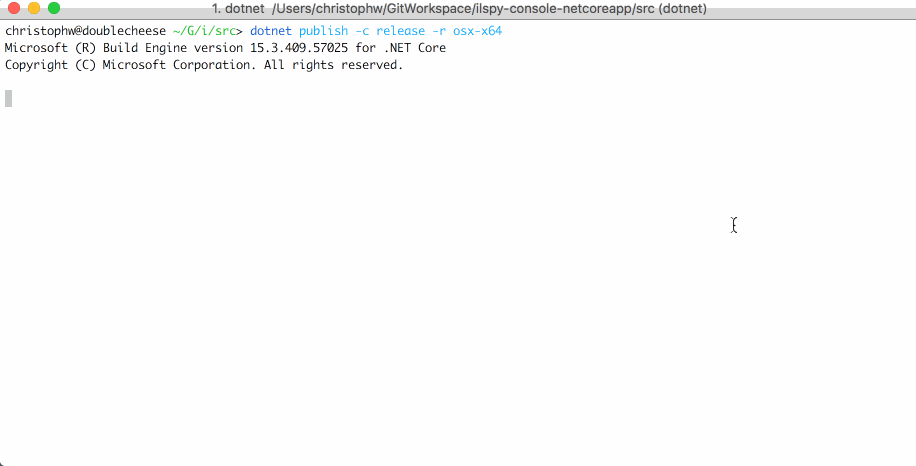

# ilspycmd

```
dotnet tool install ilspycmd -g
```

.NET Core 2.1 Tool 

```
ilspycmd -h

Usage:  [arguments] [options]

Arguments:
  Assembly filename name  The assembly that is being decompiled. This argument is mandatory.

Options:
  -h|--help                   Show help information
  -p|--project                Decompile assembly as compilable project. This requires the output directory option.
  -o|--outputdir <directory>  The output directory, if omitted decompiler output is written to standard out.
  -t|--type <type-name>       The fully qualified name of the type to decompile.
  -l|--list <entity-type(s)>  Lists all entities of the specified type(s). Valid types: c(lass), i(interface), s(truct),
 d(elegate), e(num)

-o is valid with every option and required when using -p.
```




## X-Plat Notes

[SCD Article](https://www.hanselman.com/blog/SelfcontainedNETCoreApplications.aspx)
[RuntimeIdentifiers csproj documentation](https://docs.microsoft.com/en-us/dotnet/core/tools/csproj#additions)
[RID catalog](https://docs.microsoft.com/en-us/dotnet/core/rid-catalog)

```
dotnet build -r win10-x64
dotnet build -r osx-x64

dotnet publish -c release -r win10-x64
dotnet publish -c release -r osx-x64

PS \ilspy-console-netcoreapp\src\ilspycmd\bin\Release\netcoreapp2.0\win10-x64\publish> ./ilspycmd.exe ilspycmd.dll
```
